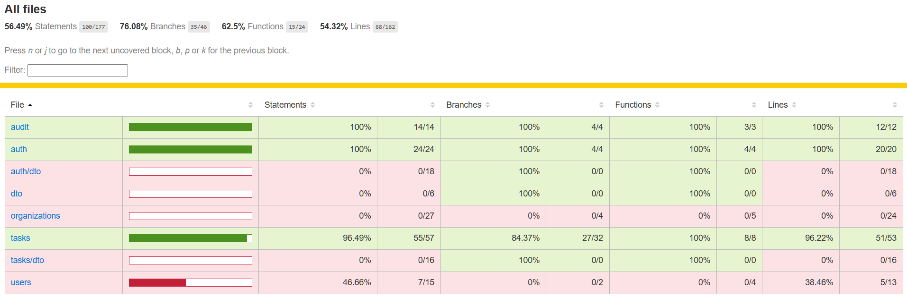

# RBAC Task Management System

A full-stack task management application built with **NestJS** (backend) and **Angular** (frontend) in an **Nx monorepo**. Features JWT authentication, role-based access control, org-scoped task management, audit logging, and a kanban board.

---

## Quick Start

### Prerequisites

- Node.js 18+
- npm 9+

### Install

```bash
git clone <repo-url>
cd <workspace>
npm install
```

### Environment Setup

Create `.env` in the workspace root:

```env
JWT_SECRET=your-super-secret-key-change-this-in-production
JWT_EXPIRES_IN=1d
PORT=3000
```

### Run

```bash
# Terminal 1 — Backend
nx serve api

# Terminal 2 — Frontend
nx serve dashboard
```

| Service  | URL                       |
|----------|---------------------------|
| Frontend | http://localhost:4200     |
| Backend  | http://localhost:3000     |
| Swagger  | http://localhost:3000/api |

### Seed First User

The database seeds `TaskFlow` with `Engineering` and `Marketing` teams on first startup. Register the first owner via Swagger:

```json
POST /auth/register
{
  "name": "owner",
  "email": "owner@gmail.com",
  "password": "password123",
  "role": "owner",
  "organizationId": 1
}
```

After that, use the dashboard to create additional users (Owner/Admin only).

---

## Architecture Overview

### Nx Monorepo Layout

```
.
├── apps/
│   ├── api/               # NestJS backend
│   └── dashboard/         # Angular frontend
├── libs/
│   ├── data/              # Shared TypeScript interfaces and enums
│   └── auth/              # NestJS RBAC guards and decorators (backend only)
├── .env
└── db.sqlite
```


### Shared Libraries

| Library     | Used By             | Contains                                                        |
|-------------|---------------------|-----------------------------------------------------------------|
| `libs/data` | `api` + `dashboard` | `Role`, `TaskStatus` enums, shared interfaces, request/response shapes |
| `libs/auth` | `api` only          | `RolesGuard`, `@Roles()` decorator, `@CurrentUser()` decorator  |

---

## Data Model

### Schema

| Table           | Description                                                    |
|-----------------|----------------------------------------------------------------|
| organizations   | Top-level tenant                                               |
| teams           | Belong to an organization                                      |
| users           | Belong to an org, optionally a team, carry a role              |
| tasks           | Org-scoped, have an owner (creator) and an assignee            |
| audit_logs      | Immutable action log with user email/role snapshots            |

### ERD


## Access Control

### Role Hierarchy

```
Owner  ⊃  Admin  ⊃  Viewer
```

Roles inherit downward — Owner can do everything Admin and Viewer can do.

| Action         | Owner       | Admin           | Viewer              |
|----------------|-------------|-----------------|---------------------|
| Create task    | ✅          | ✅              | ❌                  |
| View tasks     | All in org  | All in org      | Assigned to them only |
| Edit task      | Any         | Own only        | ❌                  |
| Delete task    | Any         | Own only        | ❌                  |
| View audit log | ✅          | ✅              | ❌                  |
| Create users   | Any role    | Viewer only     | ❌                  |

### JWT Integration

```
POST /auth/login
  → validates credentials
  → returns HS256-signed JWT

JWT Payload: { sub, email, role, organizationId, teamId }

Protected route flow:
  1. JwtAuthGuard    — validates token signature + expiry
  2. JWT Strategy    — loads full user from DB by payload.sub
  3. RolesGuard      — checks user.role against @Roles() decorator
  4. Service layer   — enforces org scoping + ownership rules
```

---

## API Documentation


| Method | Endpoint           | Auth         | Description                        |
|--------|--------------------|--------------|------------------------------------|
| POST   | /auth/register     | Public       | Create a new user                  |
| POST   | /auth/login        | Public       | Login and get JWT                  |
| GET    | /organizations     | JWT          | List orgs with teams               |
| GET    | /organizations/:id | JWT          | Get org with teams and members     |
| POST   | /tasks             | Owner, Admin | Create a task                      |
| GET    | /tasks             | All roles    | List tasks (auto-scoped by role)   |
| PUT    | /tasks/:id         | Owner, Admin | Update task                        |
| DELETE | /tasks/:id         | Owner, Admin | Delete task                        |
| GET    | /audit-log         | Owner, Admin | View audit log                     |
---

## Running Tests

```bash
# Run all tests
nx test api

# With coverage report
nx test api --coverage
```

**Coverage — core business logic:**
Performed the unit test of Backend as shown in below image:


---

## Future Improvements

- **Dark/Light theme toggle** — Angular Material theming with preference persisted to localStorage
- **Global loading indicators** — HTTP interceptor-based spinner covering all API calls
- **Custom confirm dialogs** — replace `window.confirm()` with Angular Material dialogs
- **User management dashboard** — dedicated page for Owner/Admin to manage org members and roles
- **Task caching** — HTTP cache headers on `GET /tasks` with invalidation on mutations
- **Refresh tokens** — sliding session with short-lived access tokens and long-lived refresh tokens
- **Email verification** — OTP code sent on registration, required before first login
- **Rate limiting** — `@nestjs/throttler` on auth endpoints to prevent brute force attacks
- **Pagination and filters** — cursor-based pagination on `GET /tasks` with filters by status, assignee, and date range
- **Conduct rigorous testing** - add more unit and will do end-2-end testing of api, also will do the ui testing.